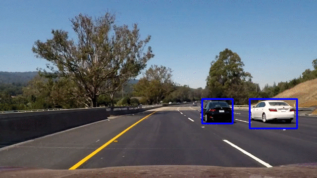

**Vehicle Detection Project**

The goals / steps of this project are the following:

* Perform a Histogram of Oriented Gradients (HOG) feature extraction on a labeled training set of images and train a classifier Linear SVM classifier
* Optionally, you can also apply a color transform and append binned color features, as well as histograms of color, to your HOG feature vector.
* Note: for those first two steps don't forget to normalize your features and randomize a selection for training and testing.
* Implement a sliding-window technique and use your trained classifier to search for vehicles in images.
* Run your pipeline on a video stream (start with the test_video.mp4 and later implement on full project_video.mp4) and create a heat map of recurring detections frame by frame to reject outliers and follow detected vehicles.
* Estimate a bounding box for vehicles detected.

[//]: # (Image References)
[image1]: ./output_images/data_exploration.png
[image2.1]: ./output_images/color_hist_vehicle.png
[image2.2]: ./output_images/color_hist_novehicle.png

[image3.1]: ./output_images/bin_spatial_vehicle.png
[image3.2]: ./output_images/bin_spatial_no_vehicle.png
[image4.1]: ./output_images/hog_features_vehicle.png
[image4.2]: ./output_images/hog_features_no_vehicle.png
[image5]: ./output_images/extract_feature.png
[image6]: ./output_images/window_search.png
[image7]: ./output_images/multiscale.png
[image8]: ./output_images/heatmap.png
[image9]: ./output_images/thresholded_heatmap.png
[image10]: ./output_images/final_box.png
[image11]: ./output_images/pipeline0.png
[image12]: ./output_images/pipeline1.png
[image13]: ./output_images/pipeline2.png
[image14]: ./output_images/pipeline3.png
[image15]: ./output_images/pipeline4.png
[image16]: ./output_images/pipeline5.png

## Data Exploration

Udacity provides the datasets based on the GTI vehicle image database, the KITTI vision benchmark suite, and examples extracted from the project video itself. The datasets can be downloaded in the following links. [vehicles](https://s3.amazonaws.com/udacity-sdc/Vehicle_Tracking/vehicles.zip) and [non-vehicles](https://s3.amazonaws.com/udacity-sdc/Vehicle_Tracking/non-vehicles.zip).

The downloaded data consists of 8792 car images and 8968 non-car images. The shape of the image is (64, 64, 3), and the data type of the image type is RBG (red, blue, green). The `data_look()` function extracts these information. Shown below is an example of each class (vehicle, non-vehicle) of the data set.

![Data Exploration][image1]

## Extract Features
### Color Histogram
Color histogram for an image is constructed by quantizing the colors within the image and counting the number of pixels of each color.  

In the `color_hist()` function, the RGB image is spitted into three channels, and then each channel generates a histogram. The red, green and blue use 8 bits each, which have integer values from 0 to 255. The range (0-255) is divided into 32 bins, such as 0-8, 8-16, ...247-255.

The color histogram of vehicle is as below:

![Histograms][image2.1]

The color histogram of No-vehicle is as below:

![Histograms][image2.2]

### Spatial Binning of Color
Raw pixel values are quite useful to include in feature vector in searching for cars. I could perform spatial binning on an image and still retain enough information to help in finding vehicles. I wrote a `bin_spatial()` function to convert test image into a feature vector.

 Spatial Binning of Color for vehicle is as below:

![Binned color features][image3.1]

Spatial Binning of Color for No-vehicle is as below:

![Binned color features][image3.2]

### HOG Features
The histogram of oriented gradients(HOG) is a feature descriptor used in computer vision and image processing for the purpose of object detection. The technique counts occurrences of gradient orientation in localized portions of an image.

The `scikit-image` package has a built in function to extract Histogram of Oriented Gradient features. Using this built in function, I defined a `get_hog_features()` function to return HOG features and visualization. The main parameters of this function are `orient`, `pix_per_cell`, and `cell_per_block`.

Car images of grayscale for testing and its corresponding HOG visulization, they look like this:

![HOG Vis][image4.1]

Car images of grayscale for testing and its corresponding HOG visulization, they look like this:

![HOG Vis][image4.2]

### Combine and Normalize Features
The three features (Color Histogram, Spatial Binning of Color and HOG Features) can be combined into a long feature vector. The range of values of raw data from different feature varies widely. One of the features with a broad range of values may dominate other features. Therefore, the range of all features should be normalized so that each feature contributes approximately proportionately to the final result.  

The result of extracting the normalized feature vector from both Vehicles and NoVehicles dataset is as follows:

![Extract Feature][image5]

## Train a classifier
Linear Support Vector Classification is used on the dataset. The dataset is split into training and testing sets using the `train_test_split()` function. Finally, the fit method of LinearSVC() obtains the model according to the given training data. Repeated experiments have found a combination of parameters that yield the best results. After learning about the whole data using the parameters, the parameters and classifier are saved using pickle.

## Hog Sub-sampling Window Search
Now it's time to search for cars and I have all the tools for it. I trained my classifier, then ran sliding window search, extracted features, and predicted whether each window contains a car or not.

In my first implementation, I extracted HOG features from each individual window, but it was inefficient. To speed up, I modified the code by extracting HOG features just once for the entire region of interest and subsampling that array for each sliding window. In this way, I implemented `find_cars()`, an efficient function that extracts HOG features only once. In `find_cars()` function, each window is defined by scaling factor where a scale of 1 would result in a window that's 8x8 cells then the overlap of each window is in terms of the cell distance. I ran `find_cars()` function multiple times for different scale values to generate multiple-scaled search windows.

The results are as follows:

|Window Search|Multiple Scaled|
|-------------|---------------|
|![WS][image6]|![MS][image7]  |

## False Positive
There may be duplicated detections of the vehicle. It can also detect objects that are not vehicles. The heat map function (`get_heatmap ()`) can merge these detections. The "hot part" of the heat map is the vehicles. The threshold function (`apply_threshold ()`) removes the regions with less than three detections.  

Finally, find final boxes from heatmap and put bounding boxes around the labeled regions. I used the `label()` function from `scikit-image` and wrote a `draw_labeled_bboxes()` function. The following images show this process.

|Heatmap           |Thresholded Heatmap           |Final Box            |
|------------------|------------------------------|---------------------|
|![Heatmap][image8]|![Thresholded Heatmap][image9]|![Final Box][image10]|

## Pipeline
I have built a `pipeline()` function that combines all the work so far. This function detects a car by inputting a single image and returns an image showing the position of the car as a box. I tested with images in the `test_images` directory.

![pipeline test][image11]
![pipeline test][image12]
![pipeline test][image13]
![pipeline test][image14]
![pipeline test][image15]
![pipeline test][image16]

## Result video

## Discussion
This project provides a framework for vehicle detection. The framework includes feature extraction, training classifier and sliding window detection. The normalized combination of the three features are used to train the SVM classifier for vehicle detection. Although the classifier can archive 99% during training, it still can cause false positives in the video. After observation, the real vehicle can cause more than three detections. Therefore, the threshold of three detections is applied to remove the widows with less than three detections.

In the future, it is useful to find weights of color histogram, spatial binning of color and HOG feature. Due to the limited time and resource, the weights of different feature are not evaluated in this project. Apart from the features extractions, convolutional neural network is another method to detect vehicles. Performance of convolutional neural networks on the ImageNet tests is now close to that of humans [1].

## References
[1] Russakovsky, Olga; Deng, Jia; Su, Hao; Krause, Jonathan; Satheesh, Sanjeev; Ma, Sean; Huang, Zhiheng; Karpathy, Andrej; Khosla, Aditya; Bernstein, Michael; Berg, Alexander C.; Fei-Fei, Li (2014). "Image Net Large Scale Visual Recognition Challenge". arXiv:1409.0575
