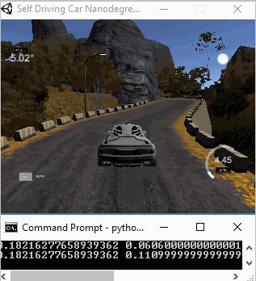
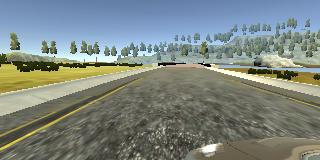
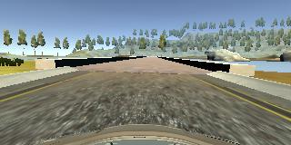
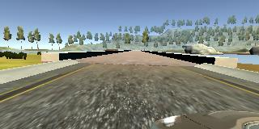
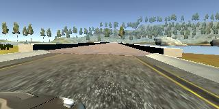
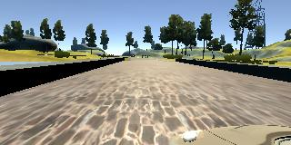

# Self-Driving Car Engineer Nanodegree
## Behavioral Cloning: Navigating a Car in a Simulator using Deep Learning

### Overview

The objective of this project is to clone human driving behavior using a Deep Neural Network. In order to achieve this, we are going to use a simple Car Simulator. When we navigates the car via keyboard, the simulator records training images from left, center and right cameras. Then those recorded images and the corresponding sheering angles are used to train the 5 layers neural network. Trained model was tested on two tracks, namely track1 and track2. The two following animations show the performance of the final model in both training and validation tracks.

Track1 | Track2
------------|---------------
 | 

model.py - The script used to create and train the model.
drive.py - The script to drive the car.
model.h5 - The trained model.

### Udacity Data Set
  I used the dataset provided by Udacity. The dataset contains 8037 images for each camera (left, centre, right). The total number is 8037\*3. I did not record images myself. The image format JPG and the image dimension is 160x320x3. The following images are from Udacity Dataset.

<table>
  <tr>
    <th>center</th>
    <th>Left</th>
    <th>right</th>
    <th>steering</th>
    <th>throttle</th>
    <th>brake</th>
    <th>speed</th>
  </tr>
  <tr>
    <th></img></th>
    <th></th>
    <th></th>
    <th>0.0617599</th>
    <th>0.9855326</th>
    <th>0</th>
    <th>2.124567</th>
  </tr>
  <tr>
  <th></img></th>
  <th></th>
  <th></th>
    <th>-0.0787459</th>
    <th>0.9855326</th>
    <th>0</th>
    <th>30.18633</th>
  </tr>
    <tr>
    <th></img></th>
    <th></th>
    <th></th>
    <th>0</th>
    <th>0</th>
    <th>0</th>
    <th>22.14829</th>
  </tr>
    <tr>
    <th>...</th>
    <th>...</th>
    <th>...</th>
    <th>...</th>
    <th>...</th>
    <th>...</th>
    <th>...</th>
  </tr>
</table>

### Data augmentation
  As the size of training set may not broad enough, data augmentation is used to increase sample size by adjusting brightness, changing direction and using other cameras.

### Preprossing Images
  Irrelevant information (i.e sky, tree and so on) is removed by croping the image. The noise is reduced by normalizing images.

### Network Structure
  The network model is similar to the model from NVIDIA's End to End Learning for Self-Driving Cars paper. The main difference between my model and the NVIDIA mode is that dropout layers are used after each Convolutional Layer to avoid overfitting issue. The network architecture is as below:
<pre>
____________________________________________________________________________________________________
Layer (type)                     Output Shape          Param #     Connected to
====================================================================================================
convolution2d_1 (Convolution2D)  (None, 32, 32, 24)    1824        convolution2d_input_1[0][0]
____________________________________________________________________________________________________
elu_1 (ELU)                      (None, 32, 32, 24)    0           convolution2d_1[0][0]
____________________________________________________________________________________________________
convolution2d_2 (Convolution2D)  (None, 16, 16, 36)    21636       elu_1[0][0]
____________________________________________________________________________________________________
elu_2 (ELU)                      (None, 16, 16, 36)    0           convolution2d_2[0][0]
____________________________________________________________________________________________________
dropout_1 (Dropout)              (None, 16, 16, 36)    0           elu_2[0][0]
____________________________________________________________________________________________________
convolution2d_3 (Convolution2D)  (None, 8, 8, 48)      43248       dropout_1[0][0]
____________________________________________________________________________________________________
elu_3 (ELU)                      (None, 8, 8, 48)      0           convolution2d_3[0][0]
____________________________________________________________________________________________________
dropout_2 (Dropout)              (None, 8, 8, 48)      0           elu_3[0][0]
____________________________________________________________________________________________________
convolution2d_4 (Convolution2D)  (None, 8, 8, 64)      27712       dropout_2[0][0]
____________________________________________________________________________________________________
elu_4 (ELU)                      (None, 8, 8, 64)      0           convolution2d_4[0][0]
____________________________________________________________________________________________________
convolution2d_5 (Convolution2D)  (None, 8, 8, 64)      36928       elu_4[0][0]
____________________________________________________________________________________________________
elu_5 (ELU)                      (None, 8, 8, 64)      0           convolution2d_5[0][0]
____________________________________________________________________________________________________
flatten_1 (Flatten)              (None, 4096)          0           elu_5[0][0]
____________________________________________________________________________________________________
dense_1 (Dense)                  (None, 1164)          4768908     flatten_1[0][0]
____________________________________________________________________________________________________
elu_6 (ELU)                      (None, 1164)          0           dense_1[0][0]
____________________________________________________________________________________________________
dropout_3 (Dropout)              (None, 1164)          0           elu_6[0][0]
____________________________________________________________________________________________________
dense_2 (Dense)                  (None, 100)           116500      dropout_3[0][0]
____________________________________________________________________________________________________
elu_7 (ELU)                      (None, 100)           0           dense_2[0][0]
____________________________________________________________________________________________________
dense_3 (Dense)                  (None, 50)            5050        elu_7[0][0]
____________________________________________________________________________________________________
elu_8 (ELU)                      (None, 50)            0           dense_3[0][0]
____________________________________________________________________________________________________
dense_4 (Dense)                  (None, 10)            510         elu_8[0][0]
____________________________________________________________________________________________________
elu_9 (ELU)                      (None, 10)            0           dense_4[0][0]
____________________________________________________________________________________________________
dense_5 (Dense)                  (None, 1)             11          elu_9[0][0]
====================================================================================================
Total params: 5,022,327
Trainable params: 5,022,327
Non-trainable params: 0
____________________________________________________________________________________________________
</pre>
### Training approach
The Udacity dataset are divided into 80% for training and 20% for validation. Each training epoch consumes 20000 images, which are generated on the fly using the data augmentation described above. In addition to that, 3000 images also generated on the fly for validation. We used Adam optimizer with default 0.001 learning rate. 3 training epochs are able to produce the weights that work well on both training and validation tracks.

### PID control to make constant speed in python drive.py for slow computer
 If the computer is not able to perform the forward pass quickly enough, then there will be a time lag between receiving input and generating a steering angle output. In this case, the car may drive off the track directly. PD control is added to make the car move at a constant speed.
