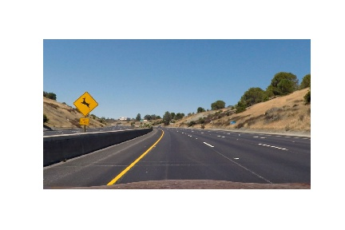
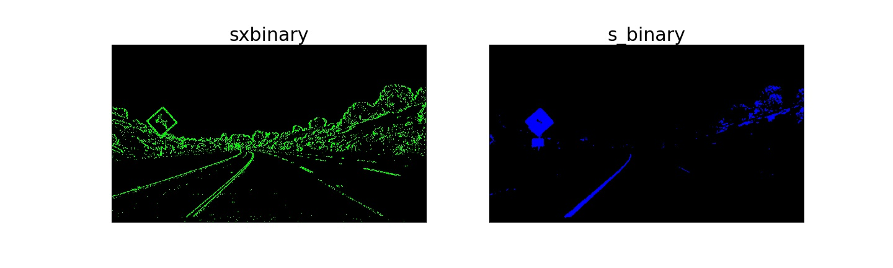
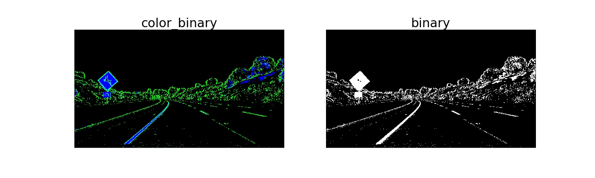
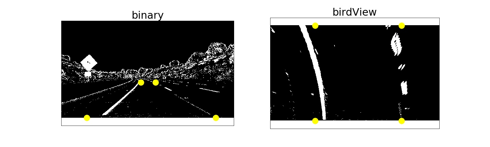
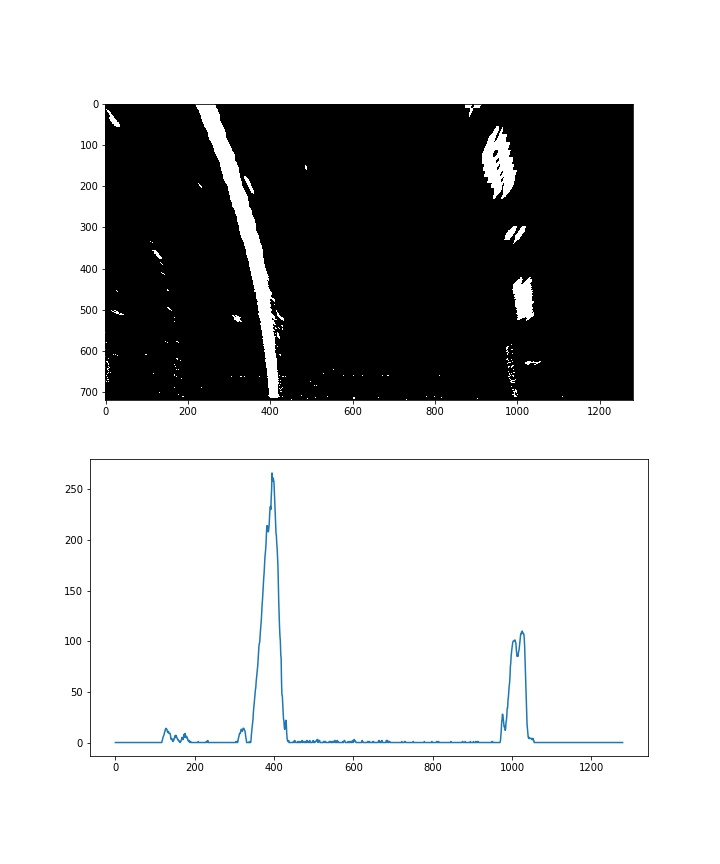
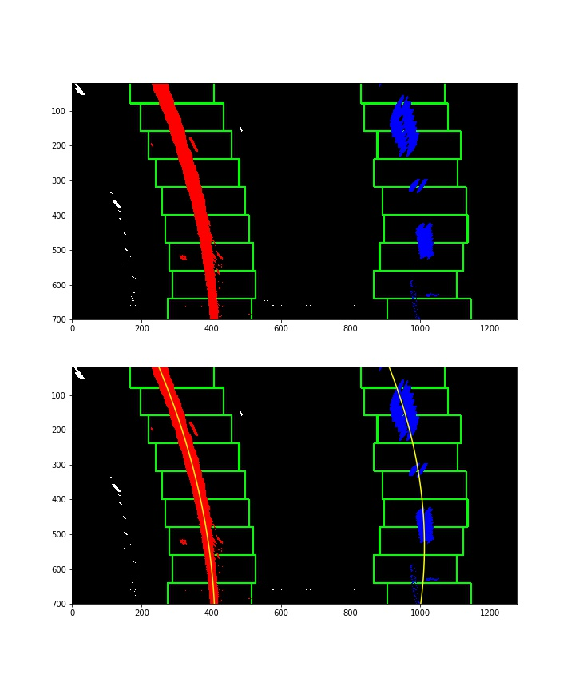
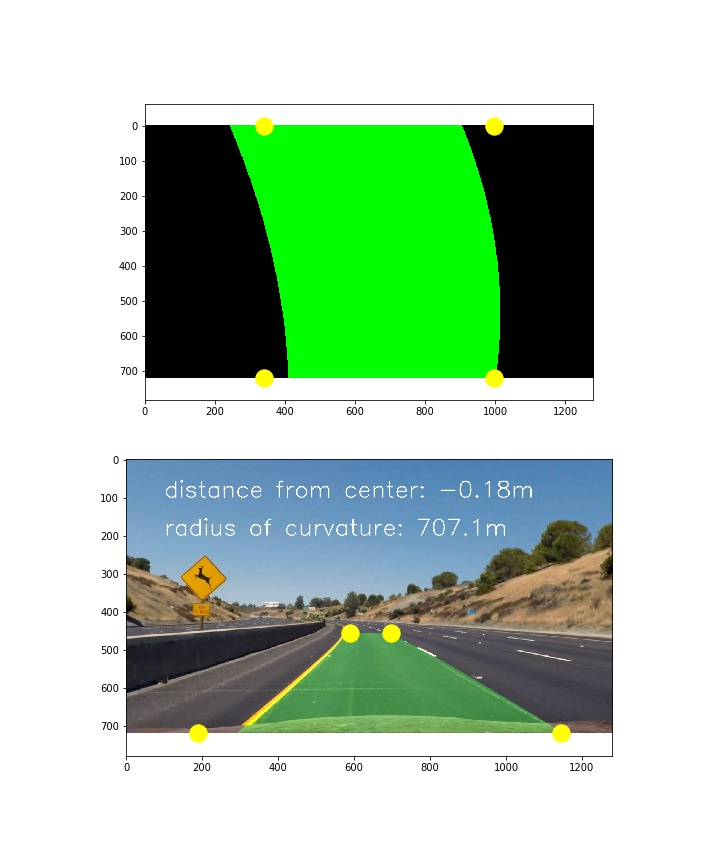
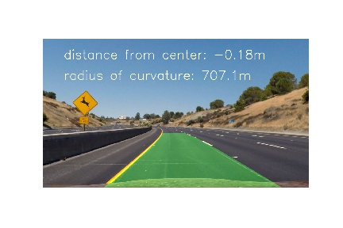

## Advanced Lane Finding

In this project, the goal is to write a software pipeline to identify the lane boundaries in a video. The pipeline is discussed as below:

#### Do camera calibration given object points and image points

A camera is an optical instrument for capture 2D images of 3D objects in real world. The capture process causes image distortions based on camera parameters(i.e. intrinsics, extrinsics, and distortion coefficients). Chessboard is used to estimate the camera parameters, because Chessboard corners are easily detectable feature points.

The cv2.calibrateCamera function estimates the intrinsic camera parameters and extrinsic parameters for each of the views. The coordinates of 3D object points and their corresponding 2D projections in each view must be specified.

The coordinates of 3D object points：
we can say chess board was kept stationary at XY plane, (so Z=0 always) and camera was moved accordingly.

The corresponding 2D projections:
The function cv2.findChessboardCorners can find the positions of internal corners of the chessboard.

Camera Matrix - a matrix describes the mapping from 3D points in the world to 2D points in an image. The result is as below:

[[  1.15396093e+03   0.00000000e+00   6.69705359e+02]
 [  0.00000000e+00   1.14802495e+03   3.85656232e+02]
 [  0.00000000e+00   0.00000000e+00   1.00000000e+00]]

Distortion coefficients -
\*radial distortion, straight lines will appear curved
\*tangential distortion, image may look nearer than expected

In short, there are five parameters, known as distortion coefficients. The result is as below:

[[ -2.41017968e-01  -5.30720497e-02  -1.15810318e-03  -1.28318544e-04
    2.67124303e-02]]

#### Apply a distortion correction to raw images.

The cv2.undistort() function removes image distortion using camera matrix and distortion coefficients from the cv2.calibrateCamera function. The result is as below:

<table border="1">
<tr>
<td>Original</td>
<td>Undistorted</td>
</tr>
<tr>
<td></td>
<td></td>
</tr>
</table>

<table border="1">
<tr>
<td>Original</td>
<td>Undistorted</td>
</tr>
<tr>
<td></td>
<td></td>
</tr>
</table>

#### Use color transforms, gradients, etc., to create a thresholded binary image.

##### Threshold x gradient
The cv.Sobel function can calculate a directional change (image gradient) in intensity or color based on the first order derivatives. Taking the gradient in the x direction emphasizes edges closer to vertical. Alternatively, taking the gradient in the y direction emphasizes edges closer to horizontal.

##### S channel (HLS space)
Red-green-blue（RGB) color space can be transformed into Hue-lightness-saturation(HLS) color space. HLS space help detect lane lines of different colors and under different lighting conditions. Compared to H and L channels, S channel is more robust to detect different colors of lane lines under varying degrees of daylight and shadow.

##### Combining Thresholds
The output is shown below. The final image color_binary is a combination of binary thresholding the S channel (HLS) and binary thresholding the result of applying the Sobel operator in the x direction on the original image.

 
 

#### Apply a perspective transform to rectify binary image ("birds-eye view").
Eye View transformation technique is to generate a top view perspective of a road. cv2.getPerspectiveTransform calculates a perspective transform from four pairs of the corresponding points.

 

#### Detect lane pixels and fit to find the lane boundary.
 The lanes poisons can be identified by a histogram along all the columns in the lower half of the image.

 

#### Determine the curvature of the lane and vehicle position with respect to center.
Sliding window can start from the base of the lane lines across y axis. As the sliding window moves up, the mean of x value of all points in the sliding window can be used as the base of the next sliding window. 9 windows are used for each lines, therefore 9 points are generated to represent a line. the curvature of the lane can calculated by curve fitting technique.       

 

#### Warp the detected lane boundaries back onto the original image.  
As discussed before, cv2.getPerspectiveTransform is used to transform the detected lane boundaries back onto the original image

#### Output visual display of the lane boundaries and numerical estimation of lane curvature and vehicle position.
Finally lane curvature and vehicle position are added into the picture.

#### Result Video
Please click the youtube link or processed_project_video.mp4 in the local folder

]https://youtu.be/9o7AWH9WIjo)

In the filter_color_and_gradient, the lightness channel in HSV color space is added to reduce the effect of shadows and color changes. The line sanity is also added to check if the line shape is changed within suitable range. In the video, the jitters is smaller than the previous submission.  

#### Discussion
The project provides a framework to identify the lanes. Visually, the framework looks good. However, the results should be measured numerically. If the line sanity checks report errors more than 2 seconds, the car may need to stop rather use previous detections. In the video, there are still some small jitters. In the future, it is necessary to find out the reasons of these small jitters.
